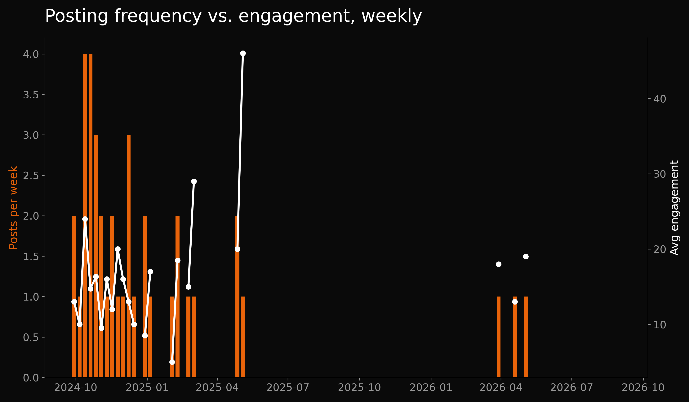
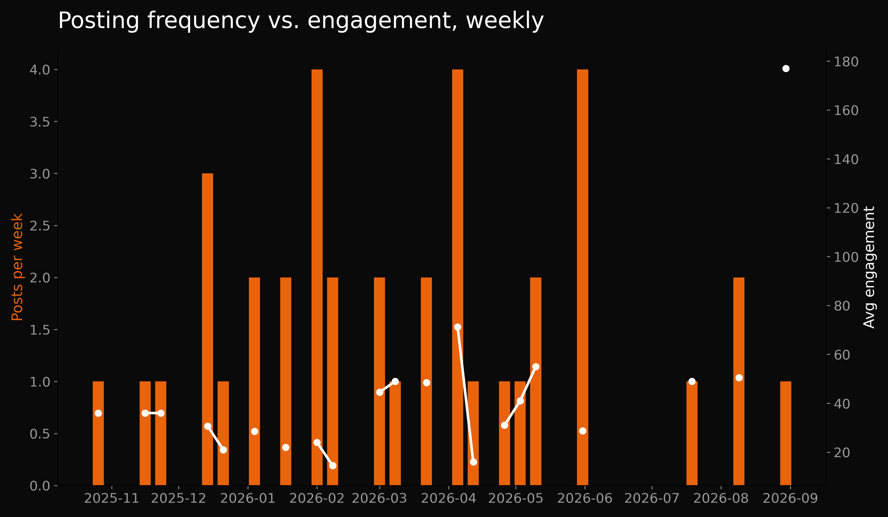
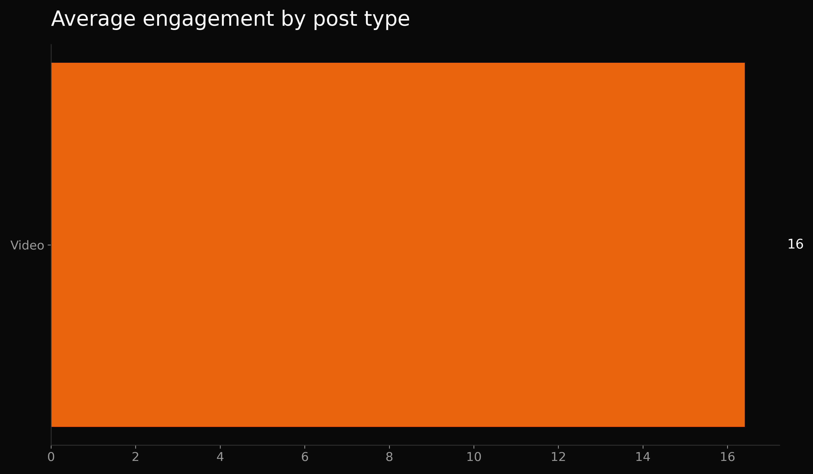
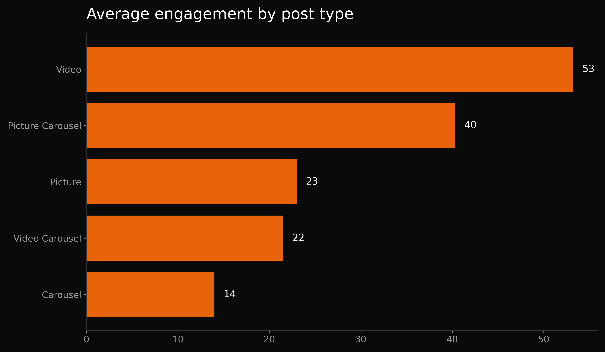
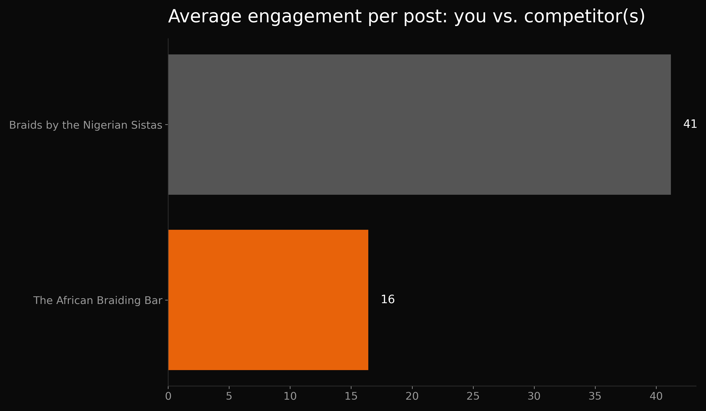

# Instagram Engagement Analysis: The African Braiding Bar vs. Braids by the Nigerian Sistas

**The African Braiding Bar is getting 151% less engagement per post than a direct local competitor — and its best-performing post on record is from October 2024.**

This is a free, public breakdown of what two competing hair-braiding businesses' own public Instagram data says about their content strategy — part of an ongoing series analyzing real businesses using only data they've already made public. Full write-up and methodology below.

---

## The headline

Braids by the Nigerian Sistas is averaging 151% more engagement per post than The African Braiding Bar, while posting more often (0.9 vs 0.4 posts/week). That gap is the real story — it's not about posting more, it's about what's earning attention once The African Braiding Bar does post.

---

## What the data shows

### Posting frequency vs. engagement

The African Braiding Bar has gone quiet for extended stretches — 78 of the last 101 weeks had zero posts. Braids by the Nigerian Sistas is more active but still inconsistent (24 of 45 weeks with zero posts) — consistency is a gap for both businesses, just a much deeper one for The African Braiding Bar.

### Engagement by post type

The African Braiding Bar doesn't have enough posts of any single type yet to say which format works best for them — that's a gap in testing, not evidence either way. Braids by the Nigerian Sistas has enough data to compare: Videos earn 1.3x the engagement of Picture Carousels.

### Head-to-head

The African Braiding Bar's strongest post on record (59 engagements, a Video from Oct 12, 2024) doesn't come close to Braids by the Nigerian Sistas' recent best (177 engagements, Aug 30, 2026) — the gap isn't a one-off, it's sustained.

---

## Full recommendation

**The African Braiding Bar — internal analysis**

Posting is inconsistent — 78 of 101 weeks had zero posts. Fix the gaps before optimizing post type: inconsistent posting resets reach every time, so even the best-performing format won't compound.

Not enough posts per type yet (need 5+ each) to trust a type-vs-type comparison — flag this as a gap rather than force a conclusion.

Best single post was a Video on Oct 12, 2024 with 59 engagements — worth reverse-engineering what made that one different.

**Braids by the Nigerian Sistas — internal analysis**

Posting is inconsistent — 24 of 45 weeks had zero posts. Fix the gaps before optimizing post type: inconsistent posting resets reach every time, so even the best-performing format won't compound.

Among post types with enough data to trust (Picture Carousel, Video), Videos earn 1.3x the engagement of Picture Carousels — shift weight toward Videos.

Best single post was a Video on Aug 30, 2026 with 177 engagements — worth reverse-engineering what made that one different.

**Competitive comparison**

Braids by the Nigerian Sistas is averaging 151% more engagement per post than The African Braiding Bar, while posting more often (0.9 vs 0.4 posts/week). That gap is the real story — it's not about posting more, it's about what's earning attention once The African Braiding Bar does post.

---

## Methodology

- **Data source:** Public Instagram post data (likes, comments, shares, post type, date) — manually logged from each business's public profile. No private analytics, no scraping tools, no login access to either account.
- **Date range:** The African Braiding Bar — full logged history spans roughly 101 weeks back from today. Braids by the Nigerian Sistas — roughly 45 weeks back from today. These ranges differ because posting frequency was measured from each business's own earliest logged post through today, to capture real gaps in posting (including any recent silence) rather than cutting the window artificially short.
- **Engagement score:** likes + comments + shares (saves excluded — not consistently visible across post types on Instagram)

## Limitations

- Engagement is a proxy for attention, not for bookings, revenue, or conversion — this data can't confirm whether either business is actually converting that attention into paying customers.
- The African Braiding Bar's type-vs-type comparison isn't reported because there isn't yet enough data per post type to trust it — that reflects a lack of testing, not proof that their current format is or isn't working.
- The two businesses' data windows differ in length (see Methodology) — the "zero-week" counts reflect different total time spans and shouldn't be compared 1:1 as raw numbers, only as a share of each business's own history.

## Disclaimer

This is an independent analysis based on publicly available Instagram data. It is not affiliated with, commissioned by, or endorsed by The African Braiding Bar or Braids by the Nigerian Sistas.

---

## Tech

Python (pandas, matplotlib). Script: [`social_pipeline.py`](./social_pipeline.py). Reusable across businesses — just supply two CSVs in the same schema (`date, post_type, likes, comments, shares`).

Part of an ongoing series analyzing public business data to find decisions, not just dashboards. More at [@adedokun_marvellous](https://instagram.com/adedokun_marvellous).
